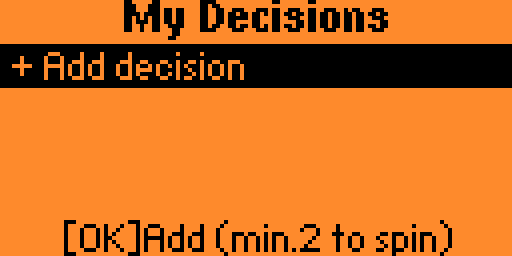
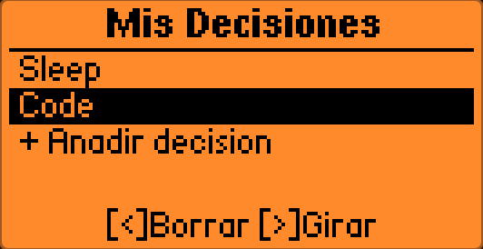
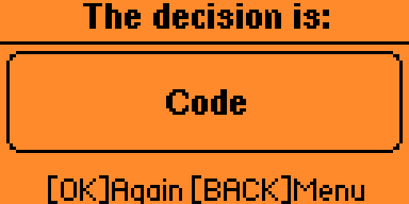

# Random Decision Maker

A [Flipper Zero](https://flipperzero.one/) app that lets you type your own choices and let a roulette wheel decide — powered by the device's hardware true-random-number generator.

[](https://catalog.flipperzero.one/application/reaction/page)
[](LICENSE)

---

## Features

- Add up to **20 custom decisions** (up to 20 characters each)
- **Roulette-style animation** with a fast phase that decelerates smoothly before landing
- **True randomness** via `furi_hal_random_get()` (hardware RNG, not a software PRNG)
- Scrollable decision list with context-sensitive on-screen hints
- Spin again or return to the list from the result screen

## Screenshots

| Manage | Spinning | Result |
|--------|----------|--------|
|  |  |  |

---

## Installation

### Via Flipper App Catalog (recommended)

Search for **"Decision Maker"** in the [Flipper App Catalog](https://catalog.flipperzero.one) and install it directly from the Flipper Mobile App or [lab.flipper.net](https://lab.flipper.net).

### Manual install (`.fap` build)

1. Set up the [Flipper Zero firmware build environment](https://github.com/flipperdevices/flipperzero-firmware/blob/dev/documentation/fbt.md).
2. Clone this repo into your firmware's `applications_user/` directory:
   ```bash
   git clone https://github.com/Gerijacki/random_decision_maker.git \
       applications_user/random_decision_maker
   ```
3. Build and deploy the external app:
   ```bash
   ./fbt launch APPSRC=applications_user/random_decision_maker
   ```

---

## Controls

### Manage screen
| Button | Action |
|--------|--------|
| `UP` / `DOWN` | Navigate the list (hold for fast scroll) |
| `OK` on **"+ Add decision"** | Open the keyboard to add a new entry |
| `OK` on a decision | Spin immediately (shortcut) |
| `LEFT` | Delete the highlighted decision |
| `RIGHT` | Spin the roulette (requires ≥ 2 decisions) |
| `BACK` | Exit the app |

### Keyboard screen
| Button | Action |
|--------|--------|
| `OK` | Confirm and save the decision |
| `BACK` | Cancel and return to the list |

### Result screen
| Button | Action |
|--------|--------|
| `OK` | Spin again with the same list |
| `BACK` | Return to the manage screen |

---

## Architecture

The app follows the standard Flipper Zero ViewDispatcher pattern with four views:

```
ViewIdManage     ──[spin/add]──►  ViewIdSpinning ──[done]──► ViewIdResult
     ▲                                                              │
     └──────────────────────────[BACK]──────────────────────────────┘
     ▲
ViewIdTextInput (keyboard)
```

A `FuriTimer` drives the spin animation by posting `CustomEventSpinTick` events to the ViewDispatcher, keeping all model mutations on the GUI thread.

---

## Contributing

Contributions are welcome! See [CONTRIBUTING.md](CONTRIBUTING.md) for guidelines.

---

## License

[MIT](LICENSE) © 2026 Gerijacki
